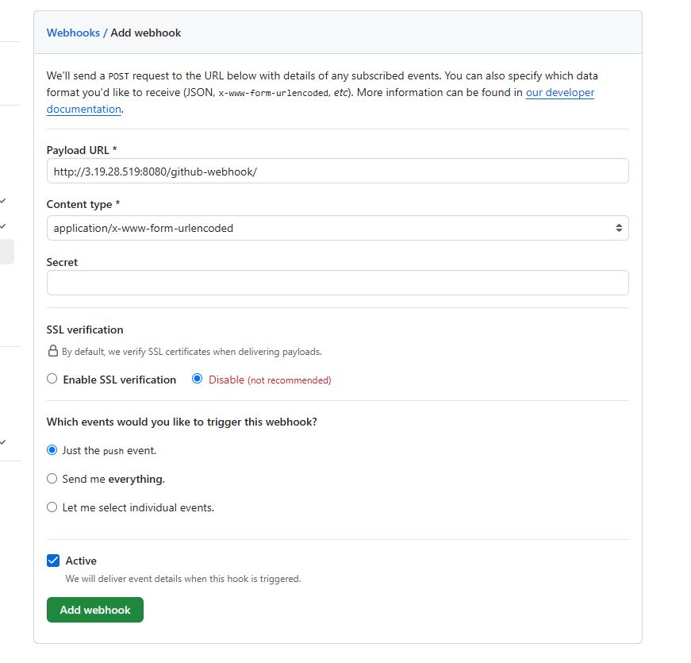

## Steps to add a Linux node (Slave) to Jenkins
- Create an ec2 instance.

- Jenkins connects to the slave via ssh. So, we need to generate a key-pair using `ssh-keygen` in the master. 
  - Also, we need to add the generated **public-key** to the slave node in **authorized_keys** file.

- Install Java in the slave. Check out the Jenkins installation docs for the commands.

- Now, in the master,
  - Go to `Manage Jenkins > Nodes`. Click on **New Node** button.

  - Provide a name and select the **Permanent Agent** radio button, click **Create**.

  - Provide an optional **Description**.

  - Leave the **Number of executors** as 1 (default).

  - Provide the **Remote root directory** as `/home/ubuntu/jenkins-test` . As the name suggests, Jenkins uses this directory as its root in the slave node. If the provided directory is not present in the agent, it will be created.
    - Inside this, folders like `jobs/`, `workspace/` etc. will be present. 

  - Provide a name in **Labels**. It will be used by the master to identify this slave.

  - Keep **Usage** to **Use this node as much as possible** (default).

  - In the **Launch method**, select **Launch agents via SSH**

    - Provide the public IP of the slave in **Host**.

    - Click on `Add` button under **Credentials**, and select **Jenkins**.

      - In the modal, select **SSH Username with private key** from the dropdown of **Kind** .

      - Leave the **Scope** to its default value. Provide a name in the **ID** and an optional description in **Description**.

      - In the **Username**, add the username of the slave instance (e.g. ubuntu). Leave the **Treat username as secret** checkbox as empty.

      - Click on the **Enter directly** radio button and paste the **private-key** generated initially. Add **Passphrase** (if any).

      - Click on **Add**.

    - Now, select the added key from **Credentials** dropdown. Also, select **Non verifying Verification Strategy** from the dropdown of **Host Key Verification Strategy**.

Check if the connection is working properly.

## Example: Declarative Pipeline
```groovy
pipeline {
    agent {label 'agent-demo'}  // this has to be the same as provided in 'Labels' box above

    stages {       // each stage will be executed in the agent
        stage('first') {
            steps {
                sh 'echo "Hello World" > test.txt'  // this file will be created at `workspace/{JOBNAME}/` folder which is inside the specified Remote root directory.
                
            }
        }
    }
}

```

## Example: Declarative Pipeline with credentials
```groovy
pipeline {
    agent {label 'agent-demo'}

    stages {
                
        stage('show how to use credentials') {
            steps {
                
                withCredentials([usernamePassword(credentialsId: 'fake-docker-passwd', passwordVariable: 'PASSWD', usernameVariable: 'USERNAME')]) {    // this is generated by Pipeline Syntax Snippet Generator. Here we store the password and username in PASSWD and USERNAME variables for future usage.

                    sh 'echo username is $USERNAME, password is $PASSWD'  // always use single quotes or triple-single quote here to prevent Groovy interpolate the secrets. 

                    // using triple-single quotes
                    sh '''      
                        echo username is $USERNAME 
                        echo password is $PASSWD
                    '''
                }   
                
            }
        }
        
        
    }
}

```
## Example: Declarative Pipeline - Cloning from GitHub
```groovy
pipeline {

    agent {label 'agent-demo'}

    stages {
                
        stage('show how to clone from GitHub') {
            steps {
                // the following line will clone the repo from GitHub to `workspace/{JOBNAME}/` folder

                //(For private repo, we need to set the credentials first)
                git branch: 'master', credentialsId: 'test-github', url: 'https://github.com/SteveSayantan/Web_BootCamp.git'   // this is generated by Pipeline Syntax Snippet Generator
                sh 'echo cloning successful'

                // or, if the repo is public, we can also do it simply as:
                sh 'git clone https://github.com/xyz'
                                
            }
        }
    }
}

```

## How to Trigger Pipeline using GitHub Webhook

In Jenkins configuration of the corresponding pipeline, make sure the **Definition** of the pipeline says **Pipeline script from SCM** i.e. it fetches Jenkinsfile from a remote repo. Also, check the **GitHub hook trigger for GITScm polling** box under **Build Triggers**.

In GitHub,
- Go to **Webhooks** under the **Settings** tab of the corresponding repository.
- Click on **Add webhook**
- In **Payload URL**, write `http://<IP_of_jenkins_master>:8080/github-webhook/`. GitHub will hit this endpoint to trigger the pipeline.
- Choose the type of event which would run this webhook, as per requirement.
- Click on **Add webhook** .
- Check the **Recent Deliveries** section in the webhook configuration to verify if the connection was successful.
- Example:
  
