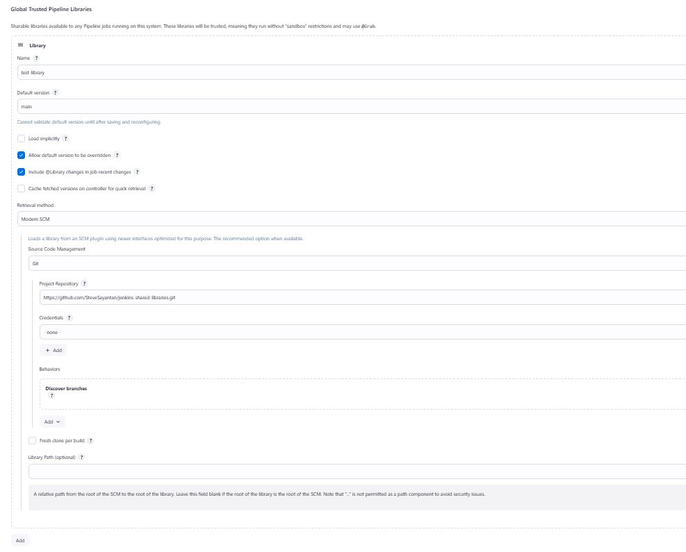

## WHAT AND WHY
It is basically a remote repo containing Groovy scripts which can be reused across multiple pipelines in Jenkins. Hence, this eliminates code duplication and makes maintainence easier. 

In future, any modification to  shared libraries automatically reflect in all dependent pipelines, thereby reducing the need to modify individual pipeline scripts when introducing new features or fixing bugs.

Additionally, shared libraries are stored in version control systems like Git, enabling versioning, tracking changes, and rolling back if needed.

## HOW
In a separate GitHub repo, we need to create a `vars` directory (in the root). Inside it, we shall store our Groovy scripts to be used in our pipelines. Each script should contain a **call** method. This repo must not contain anything else except the libraries.

>The scripts must be named in camelCase or all lowercase.

#### Adding the Library to Jenkins
- Navigate to **Manage Jenkins** » **System** » **Global Trusted Pipeline Libraries**, click on **Add**.
- Provide a name to the library. This name would be used in the pipeline to fetch it.
- Provide the name of the branch (e.g. **main**) of the remote repo where the `vars` directory is present.
- Under **Retrieval method**, provide the GitHub URL of the remote repo in **Project Repository** . By default, Jenkins looks for the `vars` directory in this.
- Add **Credentials** if it is a private repo.
- Click on **Save**.
- Example:
  

Now, we can use the scripts stored in that repo in our pipelines. In case of any changes to the remote repo, Jenkins will pick up those automatically.

See the below examples for clarity.

## Examples

- This is `helloWorld.groovy`, located in the remote repo.

  ```groovy
  def call(){
    sh 'echo Hello World'
  }
  ```
  To use it in our pipeline,
  ```groovy
  @Library("name-of-library") _     //provide the same name used to add the library to Jenkins. The whitespace followed by the _ is used to import everything in specified the library

  pipeline {
    agent {label 'agent-demo'} 

    stages {   
        stage('first') {
            steps {
                helloWorld()    // use the script-name, not the method name present in it!! This executes the call() in helloWorld.groovy           
            }
        }
    }
  }
  ```

- This is `clone.groovy`, located in the remote repo.

  ```groovy
  def call(rem_url,rem_branch){
    git url:rem_url, branch:rem_branch  // using the args provided to clone a repo
  }
  ```
  To use it in our pipeline,
  ```groovy
  @Library("name-of-library") _     //provide the same name used to add the library to Jenkins

  pipeline {
    agent {label 'agent-demo'} 

    stages {   
        stage('first') {
            steps {
                clone("https://github.com/SteveSayantan/Python-Extravaganza.git","main")   //this executes the call() in clone.groovy               
            }
        }
    }
  }
  ```

## Groovy Resources
- [YT Tutorial](https://youtu.be/vDtENU-3Lwo?si=JYK2gUj3EI76cIL-)

- [Groovy Docs](https://groovy-lang.org/single-page-documentation.html)

- [Online Article](https://www.tutorialspoint.com/groovy/index.htm)

