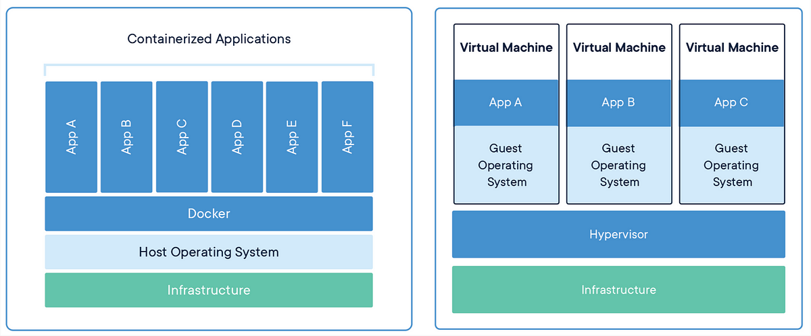
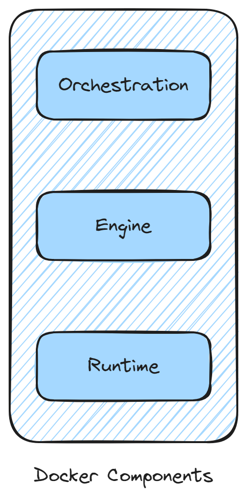
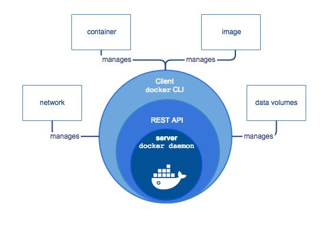

## WHY
Imagine you're developing a killer web app that has three main components - a React frontend, a Python API, and a PostgreSQL database. If you wanted to work on this project, you'd have to install Node, Python, and PostgreSQL.

How do you make sure you have the same versions as the other developers on your team or the production?

How do you ensure the version of Python (or Node or the database) your app needs isn't affected by what's already on your machine? How do you manage potential conflicts?

The solution is containers. For any details, head over to the [docs](https://docs.docker.com/).

## WHAT

Simply put, containers are isolated processes for each of your app's components. Each component - the frontend React app, the Python API engine, and the database - runs in its own isolated environment, completely isolated from everything else on your machine.

Here's what makes them awesome. Containers are:

- Self-contained: Each container has everything it needs to function with no reliance on any pre-installed dependencies on the host machine.

- Isolated: Since containers are run in isolation, they have minimal influence on the host and other containers, increasing the security of your applications.

- Independent: Each container is independently managed. Deleting one container won't affect any others.

- Portable: Containers can run anywhere! The container that runs on your development machine will work the same way in a data center or anywhere in the cloud!


## Containers vs VMs

Virtual machines (VMs) are an abstraction of physical hardware turning one server into many servers. They contain entire operating system with its own kernel, hardware drivers, programs, and applications. Spinning up a VM only to isolate a single application is a lot of overhead.

Containers are an abstraction at the app layer that packages code and dependencies together. Multiple containers can run on the same machine and share the OS kernel with other containers, each running as isolated processes in user space. Thereby allowing you to run more applications on less infrastructure.

We can also run containers on physical servers with an OS. But, containers and VMs used together provide a great deal of flexibility in deploying and managing app.




## Why are containers light-weight?
Containers are lightweight because they use a technology called containerization, which allows them to share the host operating system's kernel and libraries, while still providing isolation for the application and its dependencies. This results in a smaller footprint compared to traditional virtual machines, as the containers do not need to include a full operating system. Additionally, Docker containers are designed to be minimal, only including what is necessary for the application to run, further reducing their size. VMs, on the other hand, emulate an entire operating system, including all its libraries, utilities, and system files, resulting in a much larger size.

#### Files and Folders in container base images

```
    /bin: contains binary executable files, such as the ls, cp, and ps commands.

    /sbin: contains system binary executable files, such as the init and shutdown commands.

    /etc: contains configuration files for various system services.

    /lib: contains library files that are used by the binary executables.

    /usr: contains user-related files and utilities, such as applications, libraries, and documentation.

    /var: contains variable data, such as log files, spool files, and temporary files.

    /root: is the home directory of the root user.
```


#### Files and Folders that containers use from host operating system

```
    The host's file system: Docker containers can access the host file system using bind mounts, which allow the container to read and write files in the host file system.

    Networking stack: The host's networking stack is used to provide network connectivity to the container. Docker containers can be connected to the host's network directly or through a virtual network.

    System calls: The host's kernel handles system calls from the container, which is how the container accesses the host's resources, such as CPU, memory, and I/O.

    Namespaces: Docker containers use Linux namespaces to create isolated environments for the container's processes. Namespaces provide isolation for resources such as the file system, process ID, and network.

    Control groups (cgroups): Docker containers use cgroups to limit and control the amount of resources, such as CPU, memory, and I/O, that a container can access.
    
```

## Architectural Overview



- Runtime: It allows to start and stop containers. It has two layers:
  - runc : Works with OS, starts and stops containers, handles low-level operation.

  - container d : Manages high-level stuff e.g. pulling data from network.

- Engine: It is used to interact with docker.

- Orchestration: Used to manage containers.

### Client-Server Mechanism



Docker uses a client-server architecture. The Docker client talks to the Docker daemon process, which does the heavy lifting of building, running, and distributing your Docker containers.


- Docker daemon: This process listens to the API requests being made through the Docker client, creates,manages Docker objects such as images, containers, networks, and volumes.

- Docker client: This is what you use to interact with Docker. When you run a command using docker, the client sends the command to the daemon, which carries them out. The Docker client can communicate with more than one daemon.

## Images

To share our application with someone else, we can simply create a Dockerfile. It describes steps to create a Docker image. These images can be used to create containers in any environment. These images can also be stored online at Docker Hub.

When we run docker image you get docker containers. The container will have the application with all its dependencies.

## Docker Registries
This is where Docker images are stored. Docker Hub is a public registry that anyone can use. When you pull an image, Docker by default looks for it in the public registry and saves the image on your local system. You can also store images on your local machine or push them to the public registry.

## Open Container Initiative
There are many container runtimes e.g. containerd, runc,rkt, lxc, cri-o etc. The Open Container Initiative (OCI) is a Linux Foundation project to design open standards for containers.

OCI currently contains two specifications: 
- the Runtime Specification (defines how to run the OCI image bundle as a container) 

- the Image Specification (defines how to create an OCI Image, which includes an image manifest, a filesystem (layer) serialization, and an image configuration).
